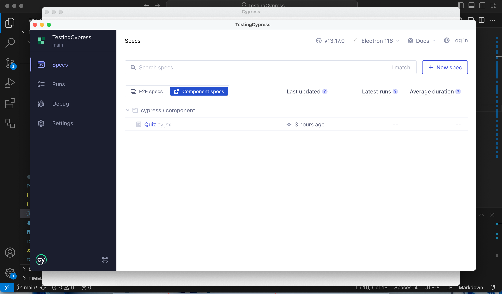

## <TESTINGCYPRESS>

video[demo]: https://youtu.be/GNdAxi-UgN8

## Screenshots

## Description

I enhanced a fully functional application by integrating Cypress for comprehensive component and end-to-end testing. The application, built using the MERN stack with a React front end, MongoDB database, and Node.js/Express.js server and API, enables users to participate in a quiz featuring ten random questions and view their final score. Despite successfully completing all required features, I encountered a persistent issue where Cypress crashes when attempting to run either E2E or component spec tests, loading everything up to that point. I invested significant time and effort into debugging this problem, but unfortunately, a solution remained elusive.

## Table of Contents

- [Installation](#installation)
- [Usage](#usage)
- [Credits](#credits)
- [License](#license)

## Installation

npm run render-build, npm run seed, npm run client:dev, npm run test

## Usage

When you reach Cypress choose either the e2e or component test.

## Contribution

Northwestern Coding Bootcamp

## Test

N/A

## License

MIT

## Contact

For any questions, please reach out to me on GitHub [5mitty](https://github.com/5mitty) or via email at jacobmsmith104@gmail.com